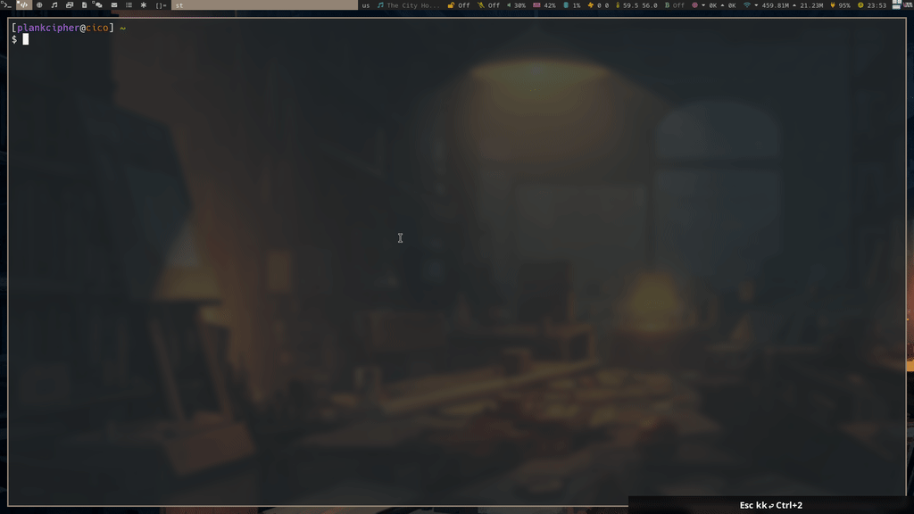
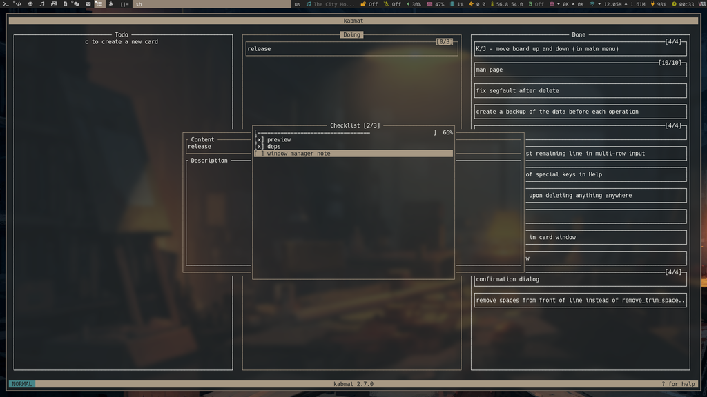

<div align="center">
  <h1>tiara</h1>
  <br>
  <br>

  <p>A modern TUI program for managing kanban boards with vim-like keybindings</p>
</div>

## Overview

Tiara is a terminal-based kanban board application that allows you to organize your tasks and projects efficiently. It features a clean, intuitive interface with vim-like keybindings for quick navigation and task management.

## Features

- **Kanban Board Management**: Create, edit, and organize boards with columns and cards
- **Checklist Support**: Add checkable items to your cards
- **Prefix System**: Use prefixes to categorize and track cards across boards
- **Git Integration**: Search for commit history related to your cards
- **Configurable**: Customize behavior through a config file
- **Vim-like Navigation**: Intuitive keybindings for efficient use

## Preview





## Dependencies

- `ncurses` for the UI
- `make` and `g++`/`gcc` for compiling and installing
- `git` for Git history features
- `gh` (GitHub CLI) for enhanced Git history search

## Installation

```bash
git clone git@github.com:tylerjwoodfin/tiara.git
cd tiara
make
sudo make install
```

## Usage

```
tiara 1.0.0
TUI program for managing kanban boards with vim-like keybindings

Usage: tiara [OPTION]...

Options:
  -h, --help              print this help message
  -v, --version           print program version

  -l, --list              list all boards
  -c, --create <name>     create a new board with the name <name>
  -o, --open <name>       open board with name <name>
  -d, --delete <name>     delete board with name <name>

  -t, --text              disable tui
  -b, --card-at-bottom    when moving cards between columns, put them at the bottom

Consult the man page for more information
```

## Configuration

Tiara stores its configuration in `~/.config/tiara/config`. You can customize various aspects of the application:

- **Data Location**: Set where your board data is stored
- **Card Placement**: Configure whether new cards are placed at the top or bottom of columns
- **UI Preferences**: Adjust colors and display options

Example config file:
```
data_file=/path/to/your/data/file
card_at_bottom=true
```

## Card Prefixes

Tiara supports a prefix system for cards to help with organization and tracking:

- **Format in data file**: `prefix::content`
- **Example**: `123::Fix login page crash`
- **Benefits**:
  - Categorize cards across boards
  - Track related items
  - Search Git history by prefix

If enabled, new cards will be created with the next sequential number.

## Git History Integration

Tiara can search for Git commit history related to your cards:

1. Press `p` in the checklist view to search for Git history
2. The app will only search for commits beginning with the pattern `boardName-cardPrefix:`
3. When a match is found, you can:
   - Press `o` to open the commit in your browser
   - Press `c` to copy the URL to your clipboard
   - Press `q` to close the dialog

This feature requires:
- Git configured with your GitHub username
- GitHub CLI (`gh`) installed and authenticated

## Keybindings

Tiara uses vim-like keybindings for intuitive navigation and operation.

### Help Window:

| Key | Function             |
| --- | -------------------- |
| k   | scroll up one line   |
| j   | scroll down one line |
| q   | close the window     |

### Main Menu:

| Key       | Function                               |
| --------- | -------------------------------------- |
| q         | quit                                   |
| ?         | show help window                       |
| k         | highlight the above board name         |
| j         | highlight the below board name         |
| g         | highlight the first board name         |
| G         | highlight the last board name          |
| K         | move highlighted board up              |
| J         | move highlighted board down            |
| d         | delete the currently highlighted board |
| r, e      | rename the currently highlighted board |
| c         | create a new board and highlight it    |
| \<Enter\> | open the currently highlighted board   |

### Input Field:

#### Normal mode:

| Key        | Function                                                         |
| ---------- | ---------------------------------------------------------------- |
| \<Esc\>, q | cancel and close the input field                                 |
| \<Enter\>  | submit and close the input field                                 |
| h          | move cursor one character to the left                            |
| l          | move cursor one character to the right                           |
| 0          | move cursor to the start of the line                             |
| $          | move cursor to the end of the line                               |
| k          | move cursor up one line (in multi-row input only)                |
| j          | move cursor down one line (in multi-row input only)              |
| g          | move cursor to the first line (in multi-row input only)          |
| G          | move cursor to the last line (in multi-row input only)           |
| i          | change mode to insert                                            |
| a          | move cursor one character to the right and change mode to insert |
| I          | move cursor to the start of the line and change mode to insert   |
| A          | move cursor to the end of the line and change mode to insert     |
| S          | delete everything on the line and change mode to insert          |
| d          | delete line under cursor (in multi-row input only)               |

#### Insert mode:

| Key                      | Function                                                                |
| ------------------------ | ----------------------------------------------------------------------- |
| \<Esc\>                  | change mode to normal                                                   |
| \<Enter\>                | submit and close the input field (or add a new line in multi-row input) |
| \<Backspace\>/\<Delete\> | delete the character before the cursor                                  |
| any other key            | inserted before the cursor                                              |

### Confirmation Window:

| Key          | Function             |
| ------------ | -------------------- |
| \<Enter\>, y | confirm action (yes) |
| \<Esc\>, n   | cancel action (no)   |

### Board Screen:

| Key              | Function                                                   |
| ---------------- | ---------------------------------------------------------- |
| q                | quit to where the board was opened from (main menu or cli) |
| ?                | show help window                                           |
| h                | focus the left column                                      |
| l                | focus the right column                                     |
| k                | focus the above card                                       |
| j                | focus the below card                                       |
| g                | focus the first card                                       |
| G                | focus the last card                                        |
| H                | move focused card to the left column                       |
| L                | move focused card to the right column                      |
| K                | move focused card up                                       |
| J                | move focused card down                                     |
| \<C-h\>, \<C-p\> | move focused column to the left                            |
| \<C-l\>, \<C-n\> | move focused column to the right                           |
| C                | create a new column                                        |
| E                | edit title of focused column                               |
| D                | delete focused column                                      |
| c                | create a new card in focused column                        |
| e                | edit focused card                                          |
| d                | delete focused card                                        |

### Card Info Window:

| Key           | Function                                      |
| ------------- | --------------------------------------------- |
| \<Esc\>, q    | cancel and close (if in normal mode)          |
| \<Enter\>     | submit and close (if in normal mode)          |
| \<Tab\>       | switch focused input (content or description) |
| c             | open checklist items window                   |
| any other key | handled by the focused input                  |

### Checklist Window:

| Key       | Function                                |
| --------- | --------------------------------------- |
| q         | close the window                        |
| k         | highlight the item above                |
| j         | highlight the item below                |
| g         | highlight the first item                |
| G         | highlight the last item                 |
| K         | move highlighted item up                |
| J         | move highlighted item down              |
| c         | add a new item to the list              |
| e         | edit content of highlighted item        |
| \<Space\> | toggle highlighted item (done/not done) |
| d         | delete highlighted item                 |
| p         | search Git history for this card        |

### Git History Dialog:

| Key | Function                                |
| --- | --------------------------------------- |
| o   | open the commit URL in your browser     |
| c   | copy the commit URL to your clipboard   |
| q   | close the dialog                        |

## Window Manager Integration

If you want to launch it sort of like an application you can make a keybinding to launch your terminal with `tiara` running instead of the shell. For example, here is how I do it with `st` and `dwm`.

```bash
st -e sh -c tiara
```

```c
static Key keys[] = {
    /* modifier                                key                        function        argument */
    ....
    { (Mod4Mask|Mod1Mask),                     XK_t,                      spawn,          SHCMD("st -e sh -c tiara") },
    ....
};
```

## Disclaimer

This was forked from [PlankCipher/kabmat](https://github.com/PlankCipher/kabmat) and modified to better fit my needs.